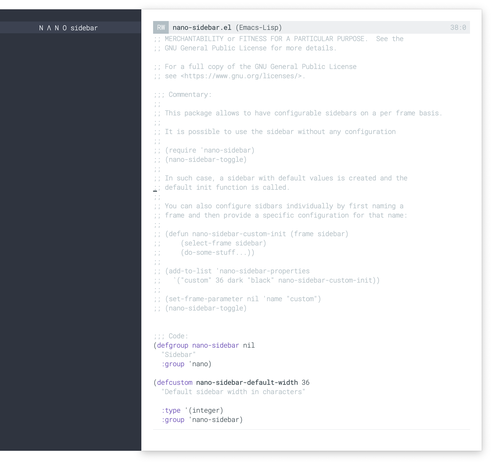

## GNU Emacs / N Λ N O sidebar

This package allows to have configurable sidebars on a per frame basis.

### Installation

Install with [straight.el](https://github.com/raxod502/straight.el):

```
(straight-use-package '(nano-sidebar :type git :host github
                                     :repo "rougier/nano-sidebar"))
```

... or install with [`quelpa`](https://github.com/quelpa/quelpa):

```emacs-lisp
(use-package nano-sidebar
  :ensure nil
  :defer t
  :quelpa (nano-sidebar
           :fetcher github
           :repo "rougier/nano-sidebar"))
```

### Usage

It is possible to use the sidebar without any configuration

```emacs-lisp
(require 'nano-sidebar)

(nano-sidebar-toggle)
```

In such case, a sidebar with default values is created and the default
init function is called.

You can also configure sidebars individually by first naming your frame
and then provide a specific configuration:

```emacs-lisp
(defun nano-sidebar-mu4e-init (frame sidebar)
  (select-frame sidebar)
  (do-some-stuff...))

(add-to-list 'nano-sidebar-properties
   `("mu4e"    36 dark ,nano-dark-background nano-sidebar-mu4e-init))

(set-frame-parameter nil 'name "mu4e")
(nano-sidebar-toggle)
```

### Screenshots




